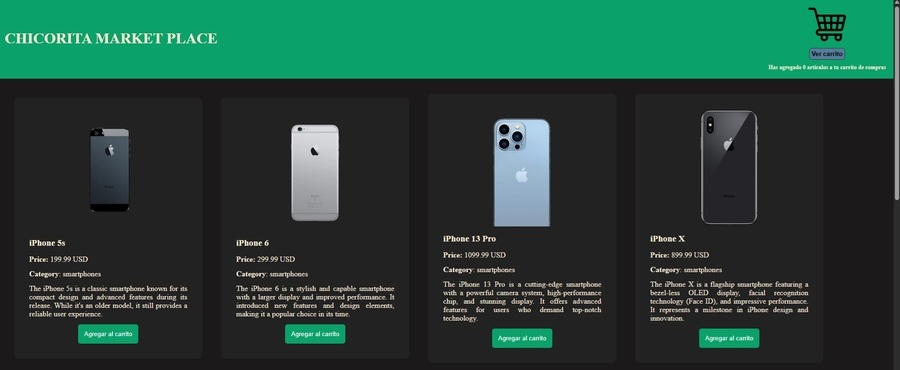

  

# Sobre mí

Soy Luciano Oviedo, desarrollador web fullstack, recientemente egresado del bootcamp _Desarrollo de Aplicaciones Web Full Stack JavaScript Trainee_ (junio–noviembre 2025), cursado gracias a una beca del programa _Talento Digital para Chile_.

Me crié y vivo en San Pedro de Atacama, en pleno desierto más árido del mundo. Ese entorno me inculcó curiosidad, capacidad de exploración, ingenio para resolver problemas con recursos limitados y adaptabilidad frente a escenarios cambiantes.

Actualmente busco consolidar mis habilidades técnicas, involucrarme en proyectos reales y seguir creciendo dentro de equipos colaborativos, donde pueda aprender de profesionales con experiencia, pero también aportar desde mis conocimientos, compromiso y ganas de seguir perfeccionándome.

Más allá del desarrollo web, disfruto del montañismo y el trekking, de los videojuegos y juegos de mesa y de viajar para conocer nuevos lugares y culturas.

## Tecnologías

### Frontend

HTML5 · CSS3 · JavaScript (ES6) · Bootstrap

  
  
  
  

### Backend

Node.js · Express · APIs REST · Express-Handlebars

    

### Bases de datos

PostgreSQL · Sequelize

  
  

### Control de versiones

Git · GitHub

  
  

### Otras herramientas

Postman · NPM

  
  

# Proyectos destacados

### 🛡️ Sitio web informativo sobre ciberseguridad

Sitio web responsivo e interactivo que aborda conceptos clave de ciberseguridad, amenazas comunes y consejos para protegerse en línea. Este proyecto integra la triada base del desarrollo web: HTML5, CSS3 y JavaScript (ES6), complementado con frameworks y librerías como Bootstrap y jQuery para mejorar la usabilidad y el diseño.

**Tecnologías utilizadas:** HTML5 · CSS3 · JavaScript · Bootstrap · jQuery · Git · GitHub

[🌐 Demo](https://luciano-oviedo.github.io/Web-informativa-de-ciberseguridad/) · [📁 Repositorio](https://github.com/Luciano-Oviedo/Web-informativa-de-ciberseguridad)

---

### 🛒 Interfaz de tienda e-commerce

Aplicación frontend que consume una API externa para obtener productos, mostrarlos dinámicamente y permitir su gestión mediante un carrito de compras. Se presenta una interfaz gráfica que lista productos, permite agregarlos al carrito, eliminarlos y visualizar el total de artículos seleccionados. Todo se construye dinámicamente desde JavaScript para reforzar el trabajo con elementos generados en tiempo real.

El objetivo principal fue poner en práctica programación orientada a objetos (POO), programación asíncrona, el uso de fetch API, manipulación estructurada del DOM, control de eventos y manejo de errores. También implementé funcionalidades modernas de JavaScript ES6+, como clases, funciones flecha, desestructuración y template literals.

**Tecnologías utilizadas:** HTML5 · CSS3 · JavaScript (ES6+) · fetch API · Git · GitHub

[🌐 Demo](https://luciano-oviedo.github.io/Fake-ecommerce/) · [📁 Repositorio](https://github.com/Luciano-Oviedo/Fake-ecommerce)

---

### 🗂️ Aplicación de gestión de usuarios y roles con base de datos relacional

Aplicación backend construida con Express y PostgreSQL para administrar usuarios y roles utilizando Sequelize como ORM. Incluye operaciones CRUD completas y asociaciones uno a muchos entre entidades, siguiendo buenas prácticas de estructura, modularización y manejo de conexión a base de datos.

El objetivo principal fue reforzar el uso de ORM en entornos Node.js, la definición de modelos, la creación de rutas RESTful y la correcta interacción con PostgreSQL. Además, el proyecto permitió aplicar principios de arquitectura MVC, manejo de errores y organización de código orientado a la mantenibilidad.

**Tecnologías utilizadas:** Node.js · Express · PostgreSQL · Sequelize · Postman · Git · GitHub

[📁 Repositorio](https://github.com/Luciano-Oviedo/App-gestion-de-usuarios-y-roles.git)

---

### 🔐 API REST para gestión de usuarios con autenticación JWT

Backend desarrollado con Node.js y Express para gestionar perfiles de usuario en una aplicación tipo red social. Permite registrar usuarios, iniciar sesión, obtener/actualizar/eliminar perfiles y subir imágenes de perfil mediante express-fileupload, aplicando validaciones de tipo y tamaño. La API sigue buenas prácticas REST y protege sus rutas mediante autenticación JWT.

El objetivo central fue implementar una API robusta siguiendo la arquitectura RESTful, integrando un sistema de autenticación y autorización seguro basado en tokens, y gestionando la subida de archivos de forma controlada. Además, reforcé conceptos clave como validación de datos, cifrado de contraseñas y protección de rutas sensibles.

**Tecnologías utilizadas:** Node.js · Express · JWT · bcrypt · express-fileupload · Postman · Git · GitHub

[📁 Repositorio](https://github.com/Luciano-Oviedo/API-RESTful-gestion-usuarios-RRSS)

# Contacto

  
   
  📍 San Pedro de Atacama, Chile

